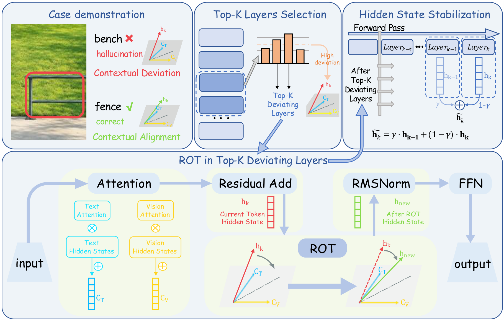
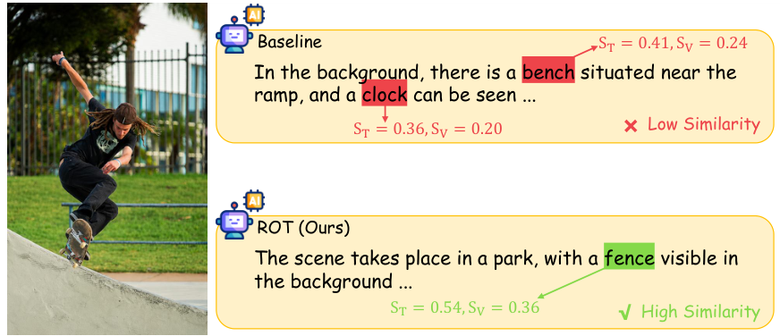
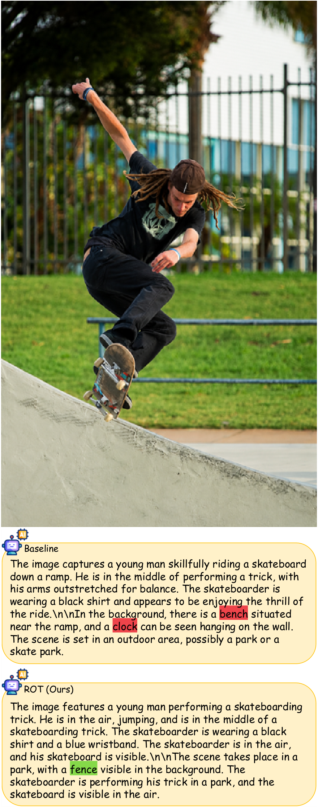
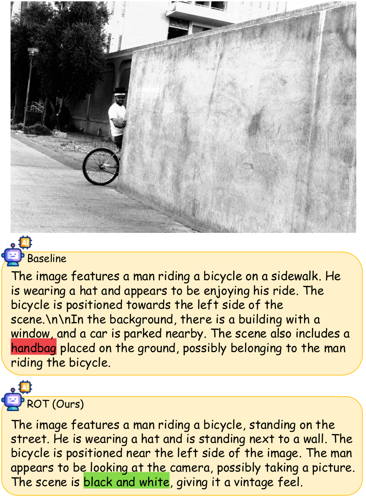
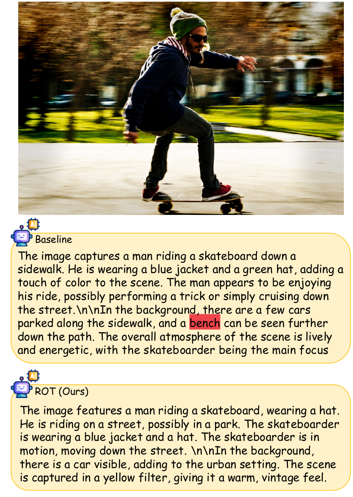
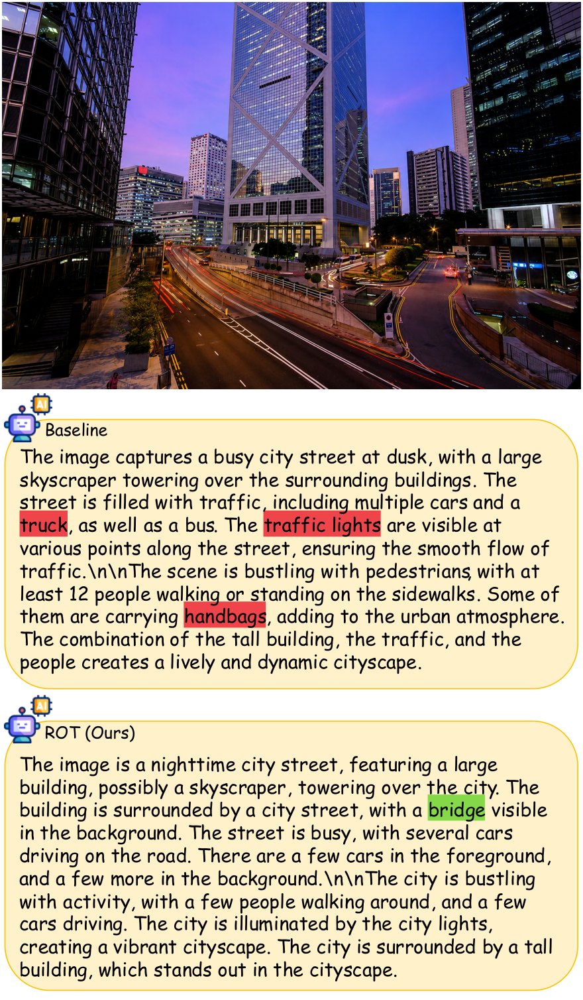

<p align="center">
  
</p>
<p align="center"><strong>Rotating Hidden States towards Contextual Vectors<br>for Hallucination Mitigation in LVLMs</strong></p>
<h3 align="center">🎉 EMNLP 2026 Oral 🎉</h3>
<p align="center">
  <a href="paper/ROT_EMNLP2026_camera_ready.pdf">Paper</a> ·
  <a href="#method">Method</a> ·
  <a href="#results">Results</a> ·
  <a href="#quick-start">Quick start</a> ·
  <a href="#case-studies">Case studies</a> ·
  <a href="#citation">Citation</a>
</p>

**Ground generation by correcting its direction.** ROT is a training-free inference method that mitigates object hallucination in large vision-language models. It rotates hidden states toward their textual and visual contexts while preserving their norm, then stabilizes the calibrated representations in subsequent layers.

<p align="center">
  
</p>

## Method

Hallucinated tokens can deviate from **both** textual and visual contexts. ROT intervenes in the hidden state after self-attention and residual addition, before the feed-forward network:

1. **Detect contextual deviation.** Aggregate attention-weighted textual and visual context vectors, and measure their cosine similarities with the current hidden state.
2. **Rotate toward context.** Correct the hidden-state direction toward the multimodal context while retaining its original norm.
3. **Stabilize propagation.** Smooth representations in later layers to preserve the corrected trajectory.

The deviation indicator is

$$E = 2 - S_T - S_V, \qquad S_T = \cos(h_k, C_T), \quad S_V = \cos(h_k, C_V).$$

ROT requires no additional training or model-weight updates. This release provides the inference implementation for the LLaVA and Qwen-VL families, with POPE question answering and COCO caption generation for CHAIR evaluation.

## Results

**LLaVA-1.5-7B, paper Table 1.** Lower CHAIR scores indicate fewer hallucinations; higher POPE and MME scores are better.

| Method | CHAIR C_S ↓ | CHAIR C_I ↓ | POPE Acc ↑ | POPE F1 ↑ | MME Total ↑ |
| :--- | ---: | ---: | ---: | ---: | ---: |
| Greedy | 54.4 | 15.7 | 85.5 | 85.9 | 440.67 |
| VCD | 51.1 | 14.7 | 85.0 | 85.3 | 466.34 |
| OPERA | 47.0 | 14.6 | 85.2 | 84.2 | 415.67 |
| RITUAL | 45.2 | 13.2 | 84.3 | 85.2 | 476.67 |
| Vissink | 52.4 | 14.5 | 86.5 | 86.0 | 483.33 |
| SID | 44.2 | 12.8 | 85.8 | 85.6 | 467.60 |
| TAME | 41.3 | 12.4 | 85.7 | 85.4 | 496.67 |
| LVLMs-Saliency | 35.6 | 8.2 | **87.5** | **87.0** | 498.33 |
| **ROT** | **33.0** | **6.7** | 86.6 | 86.3 | **506.66** |

Relative to greedy decoding, ROT reduces C_S by **39.3%** and C_I by **57.3%** in this comparison. MME Total here sums the **existence, position, and color** subtasks.

<details>
<summary><strong>Generalization across model families and scales</strong></summary>

CHAIR results from paper Table 2:

| Model | Greedy C_S ↓ | ROT C_S ↓ | Greedy C_I ↓ | ROT C_I ↓ |
| :--- | ---: | ---: | ---: | ---: |
| LLaVA-1.5-7B | 54.4 | **33.0** | 15.7 | **6.7** |
| LLaVA-1.5-13B | 41.4 | **30.8** | 12.7 | **4.3** |
| Qwen2-VL-7B | 24.2 | **21.4** | 8.0 | **4.9** |
| Qwen2.5-VL-32B | 43.6 | **30.9** | 9.5 | **8.7** |

See the paper for POPE subset results, baseline references, and evaluation protocols.

</details>

## Quick start

The repository provides `rot.py` and selected download helpers from our experimental code.

Run from the repository root in your CUDA environment:

```bash
pip install -r requirements.txt --extra-index-url https://download.pytorch.org/whl/cu124
python download/download_model.py
```

## Case studies

**From hallucinated objects to grounded descriptions.** In the paper's skateboard example, the baseline hallucinates a *bench* and a *clock*. ROT instead describes the visible *fence*, with higher similarity to both context vectors.

<p align="center">
  
</p>

<details>
<summary><strong>Example 1 · Bench and clock → fence</strong></summary>

<p align="center"></p>

</details>

<details>
<summary><strong>Example 2 · Remove the handbag hallucination; identify black and white</strong></summary>

<p align="center"></p>

</details>

<details>
<summary><strong>Example 3 · Remove the hallucinated bench</strong></summary>

<p align="center"></p>

</details>

<details>
<summary><strong>Example 4 · Suppress multiple hallucinations; identify the bridge</strong></summary>

<p align="center"></p>

</details>

## Repository layout

```text
ROT/
├── README.md
├── rot.py
├── requirements.txt
├── download/
│   ├── download_model.py
│   ├── download_chair_data.py
│   └── download_mme.py
├── assets/
│   ├── rot-logo.png
│   ├── main_image.png
│   ├── case_study.png
│   └── case_study_1.png … case_study_4.png
└── paper/
    └── ROT_EMNLP2026_camera_ready.pdf
```

## Citation

```bibtex
@misc{du2026rotrotatinghiddenstates,
      title={ROT: Rotating Hidden States towards Contextual Vectors for Hallucination Mitigation in LVLMs},
      author={Yijing Du and Xiangcheng Zhan and Shuo Yang},
      year={2026},
      eprint={2610.06056},
      archivePrefix={arXiv},
      primaryClass={cs.CV},
      url={https://arxiv.org/abs/2610.06056},
}
```

## Acknowledgments

ROT builds on the LLaVA and Qwen model families and uses COCO/CHAIR, POPE, and MME benchmarks.
